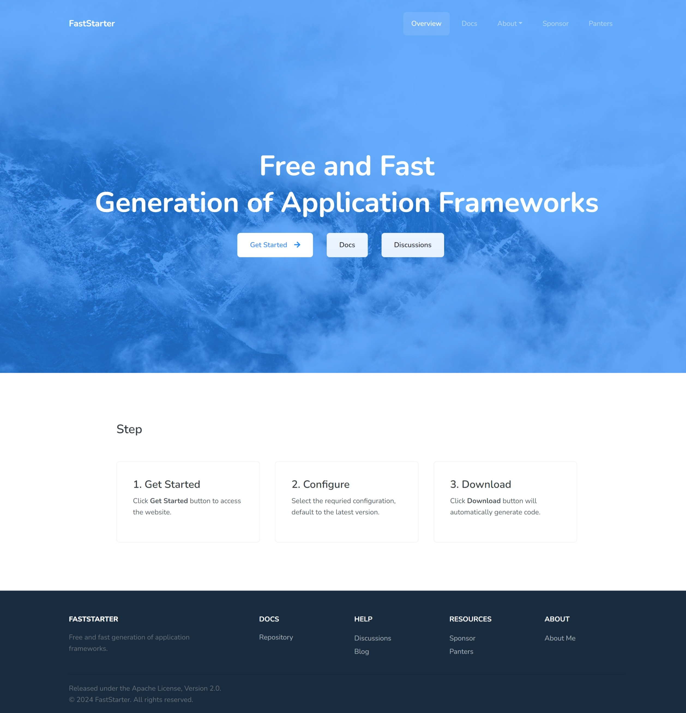
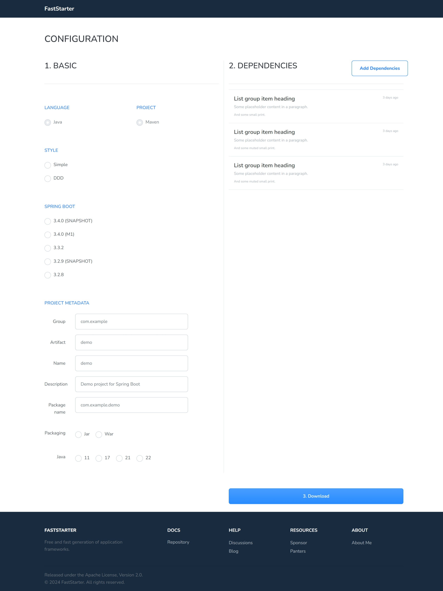
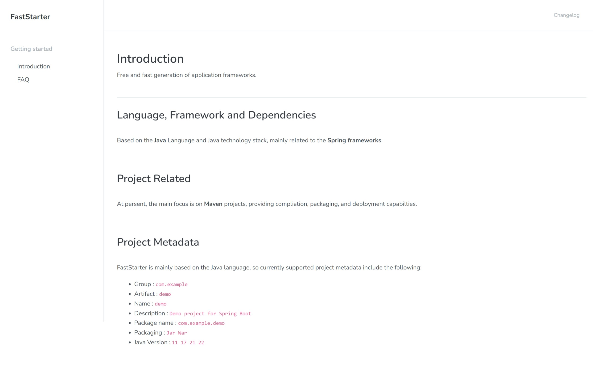
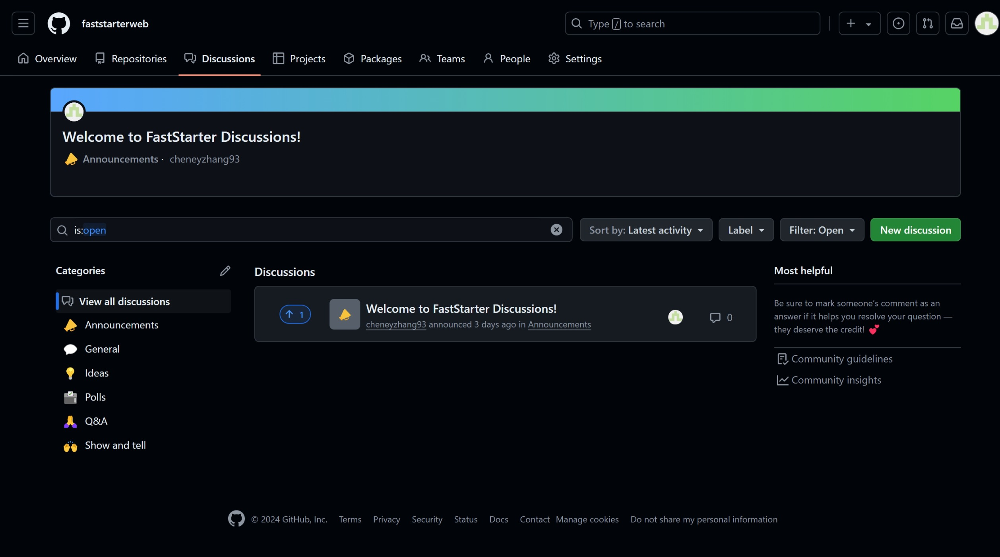

## 1. Overview Page

Mainly divided into Get Started, Docs, and others

### 1.1 Get Started Button

Get Started button will guide you to the configuration page.

### 1.2 Docs Button

Docs button will guide you to the docs page.

### 1.3 Discusson Button

Discusson button will guide you to the faststarter`s github discusson.

## 2. Configure Page

Follow step **1. Basic, 2. Configure, 3. Download to opreate**. Select the required configuration for your project, and click Download button to obtain the appliation code.

## 3. Docs Page

Mainly about the user documentation and FAQ of FastStarter, and is currently being improved.

## 4. Discusson

This is github discusson, it addiress is [https://github.com/orgs/faststarterweb/discussions](https://github.com/orgs/faststarterweb/discussions)

## 5. Other Pages

The Sponsor and Partner pages are still under development.